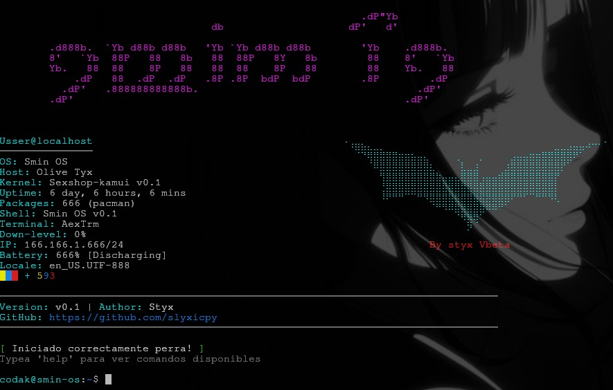

# SminOS

**Simple project developed in Python, focused on lightweight and fast utilities.**  
Not as powerful as a real operating system, but designed to be **portable** with quick configurations and useful resources for coders.

---

## System

- **ai** → local chat with GGUF model  
- **bk** → back routes by levels  
- **cat** → concatenate files  
- **cc** → basic carding menu  
- **cd** → open routes  
- **ls** → list routes  
- **rm** → delete folders/files  
- **mv** → rename/move folders/files  
- **mkdir** → create folders  
- **touch** → create files  
- **claude** → use Anthropics API  
- **clock** → simple clock  
- **cp** → copy files/folders  
- **cryp** → encode/decode text `[base64 | hex | rot13 | url | bin]`  
- **cupra** → encrypt/decrypt files  
- **docs** → documentation sheets for tools  
- **dork** → dork sheets  
- **sheet** → cheat sheets (tech & programming languages)  
- **good** → inspired by TempleOS  
- **gpt** → use OpenAI API  
- **haxy** → micro-sheets for web vulnerabilities (SQLi, XSS, LFI, etc.)  
- **hints** → random code tips  
- **kak** → Kakoune editor + auto config  
- **nano** → Nano editor + simple auto config  
- **nvim** → Neovim editor + auto config  
- **vim** → Vim classic editor + auto config  
- **matrix** → matrix animation  
- **notes** → simple `.txt` notes  
- **notices** → scrap new cybersecurity notices  
- **sexy** → random ASCII art  
- **stube** → background music player with mpv  
- **tich** → device specifications  
- **update** → check for the latest SminOS update  

---

## Plugins

- **infurl** → web info  
- **ip** → IP info  
- **ip2** → extended IP info  
- **proxie** → scrape live proxies  
- **scanp** → port scanner  
- **ua** → user-agents + payloads  

---

## integrated
- **help** → show all commands
- **clear** → clean screen
- **exit** → exit SminOs
- **info** → info SminOs
- **scan** → reload commands

---



---

## Installation

```
git clone https://github.com/slyxicpy/SminOS.git
cd SminOS
pip install -r requirements.txt
python3 minso.py
```

## Win/linux env
```
python3 -m venv venv
source venv/bin/activate  # Linux/Mac
venv\Scripts\activate     # Windows
```
---
<p align="center">
  
</p>
